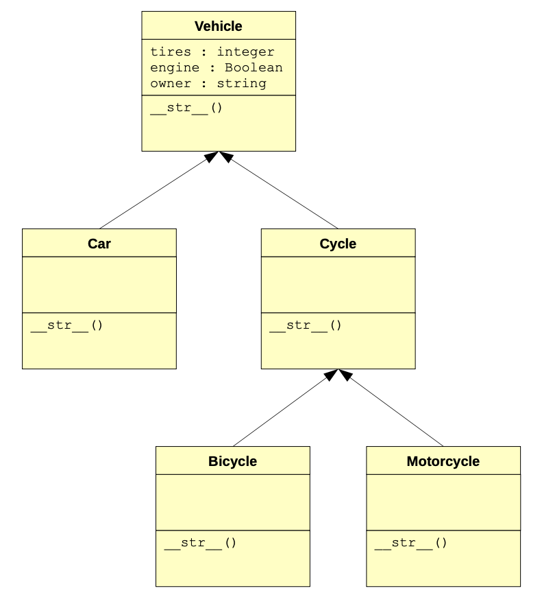

## Inheritance

The last major topic that was discussed in the object-oriented paradigm was inheritance. To review, there are cases where it is advantageous to have one class (called a subclass) inherit state and behavior from another class (called a superclass). Using inheritance allows us, among many other things, to avoid excessive repetition and code duplication. This makes maintaining code much easier.

As an example, let's assume that you are writing a program to store information about the kinds of vehicles that a car mechanic's garage may deal with on a daily basis. For simplicity, suppose that the mechanic only keeps track of the number of tires that a car has (yes, there are some cars that have three tires), whether the car has a working engine, and the car's owner. In this case, the car class would need three instance variables (one for each of the mentioned attributes). It may even have a function that allows a car's information to be output in a meaningful way (i.e., it would implement a `__str__` method). Even though the class is very basic, we'll use it to make a point. Here is the source code for the `Car` class, along with some sample testing code in the main part of the program:

```python
class Car:

    def __init__(self, name):
        self.tires = 4
        self.engine = True
        self.owner = name

    def __str__(self):
        return "Car; owner={}, tires={}, engine={}".format(self.owner, self.tires, self.engine)

c1 = Car("John")
print(c1)
```

Of course, the output is fairly simple to determine:

```default
Car; owner=John, tires=4, engine=True
```

Now consider the case where, one day, the mechanic's garage decides to repair bicycles as well. A very quick fix would be to create a similar class just for bicycles. In fact, here are comparisons of the `Car` and `Bicycle` classes (with a slightly modified main part of the program):

```python
class Car:

    def __init__(self, name):
        self.tires = 4
        self.engine = True
        self.owner = name

    def __str__(self):
        return "Car; owner={}, tires={}, engine={}".format(self.owner, self.tires, self.engine)


class Bicycle:

    def __init__(self, name):
        self.tires = 2
        self.engine = False
        self.owner = name

    def __str__(self):
        return "Bicycle; owner={}, tires={}, engine={}".format(self.owner, self.tires, self.engine)

c1 = Car("John")
b1 = Bicycle("Jane")

print(c1)
print(b1)
```

And here is the output of this modified program:

```default
Car; owner=John, tires=4, engine=True
Bicycle; owner=Jane, tires=2, engine=False
```

Notice the code duplication? In fact, the `Bicycle` class is almost an exact copy of the `Car` class. The only differences are that a bicycle has only two tires, has no engine, and is called a bicycle. As you might imagine, creating similar classes this way gets very ineffective the larger classes get, and the more classes an application requires. For example, what would need to be done if the garage decided to repair motorcycles as well? Expanding the example above, another class would have to be created. In fact, it would also be very similar to the `Car` class.

What would happen if a mistake were made in the source code that implements the way that tires are accounted for? Or suppose that an adjustment needed to be made (e.g., adding another instance variable to keep track of a spare tire). In the best case, modifications to all three classes would have to be made, thereby increasing the chances of making mistakes and causing errors.

As discussed previously, the concept of inheritance allows us to create a superclass that can encapsulate all of the common members that one or more subclasses can share. The subclasses that are created from some superclass can be considered to be specific subtypes of the superclass.

One way to modify the code in the example above to utilize inheritance is to create a `Vehicle` superclass that defines all of the members that are shared among all types of vehicles in the application: cars, bicycle, and motorcycles. The car, bicycle, and motorcycle classes would then inherit from and become subclasses of the `Vehicle` class. This greatly helps to reduce code duplication. To illustrate this, here are modified classes, along with some test code, that updates the classes above and implements inheritance:

```python
class Vehicle:

    def __init__(self, name):
        self.tires = None
        self.engine = None
        self.owner = name

    def __str__(self):
        return "owner={}, tires={}, engine={}".format(self.owner, self.tires, self.engine)


class Car(Vehicle):

    def __init__(self, name):
        super().__init__(name)
        self.tires = 4
        self.engine = True

    def __str__(self):
        return "Car; " + super().__str__()


class Bicycle(Vehicle):

    def __init__(self, name):
        super().__init__(name)
        self.tires = 2
        self.engine = False

    def __str__(self):
        return "Bicycle; " + super().__str__()


class Motorcycle(Vehicle):

    def __init__(self, name):
        super().__init__(name)
        self.tires = 2
        self.engine = True

    def __str__(self):
        return "Motorcycle; " + super().__str__()


c1 = Car("John")
b1 = Bicycle("Jane")
m1 = Motorcycle("Randy")

print(c1)
print(b1)
print(m1)
```

And here is the output of the program

```default
Car; owner=John, tires=4, engine=True
Bicycle; owner=Jane, tires=2, engine=False
Motorcycle; owner=Randy, tires=2, engine=True
```

Look over the code above and see if it makes sense to you. Notice the default values of None for the variables `tires` and `engine`. These values are overwritten in the subclasses, depending on which subclass is initialized, as follows:

|Class|tires|engine|
|:----|:--|:----|
|Vehicle|None|None|
|Car|4|True|
|Bicycle|2|False|
|Motorcycle|2|True|

Also notice that the constructor of the `Vehicle` class (the superclass) is called in the constructor of each of the subclasses. In fact, this is the first statement in the constructors of the subclasses. That is, the initialization of a car, bicycle, and motorcycle first means to initialize a vehicle. This sets default values for the variables `tires` and `engine`. The owner of the vehicle is passed in when instantiating each of the subclasses, and is forwarded to the superclass (where the value is formally assigned). Any remaining initialization of the subclasses is done after the call to the constructor in the superclass (i.e., specific values for the variables `tires` and `engine`).

Also, the class output magic function `__str__` also calls the matching function in the `Vehicle` superclass. Why? Well, it actually generates the appropriate output for any kind of vehicle (i.e., owner, number of tires, and whether or not it has an engine). The only distinguishing characteristic is the actual name of the class. Therefore, the subclasses first generate a string matching their name followed by a call to the superclass function (which generates a string containing the information specified above).

As a last modification, note that bicycles and motorcycles have the same number of tires. Since we can have many levels of inheritance, let's try to add a generic `Cycle` class that encapsulates the attributes shared by all kinds of *cycles* (i.e., bicycles and motorcycles). To be clear, the application now has the following class diagram:

{width=75%}

::: {.callout-tip title="Activity"}
Implement the `Cycle` class; then, modify the `Bicycle` and `Motorcycle` classes to inherit from the `Cycle` class.
:::

The act of designing an application, particularly a large one, requires consideration of many factors that help to ensure its success. That is, there are ideas that must be considered in order to make designing an application easier. Much of the remainder of this lesson is dedicated to identifying such techniques.

