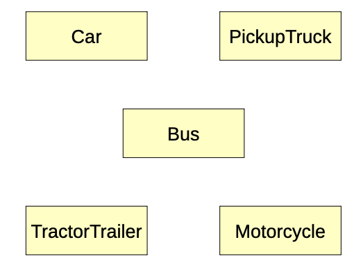

## Abstraction and Modularization

::: {.callout-tip title="Definition"}
**Abstraction** is the ability to ignore the details of parts of a system in order to focus our attention at a _higher_ level.
:::

Think of a Google map. When zoomed out to its default level, an entire city may be visible. Detailed street names, building structures, and so on, are invisible as they would clutter the map. Similarly, areas surrounding the city (e.g., state, region, country) are not visible. Zooming in reveals more detail of a part of the city; however, some of the surrounding detail that was present before is lost. Zooming out may further hide details, but bring in surrounding cities and towns. These *zoom levels* present just enough information that is required to process the map at that level.

The object-oriented paradigm is actually emblematic of this concept. Consider the traffic simulation application that was discussed in a previous lesson. In case you have forgotten, its goal was to model vehicle traffic in a large city for the purpose of analyzing how it manages traffic during rush hour. This kind of application would be useful in learning about traffic patterns, congestion, and so on. In fact, it could help to redesign roads, entrances to and exits from highways and interstates, the placement and timing of traffic signals, etc. As discussed, such an application may include classes for cars, pickup trucks, buses, tractor trailers, motorcycles, and so on, since all of these things contribute to the traffic in the city. We initially modeled it with the following class diagram:

{width=50%}

In the simulation, the way in which cars, pickup trucks, buses, motorcycles, and so on, are implemented doesn't matter to a city official using it to make zoning decisions. Those details are abstracted away from the user. As another example, the programmers tasked with extending the traffic simulation don't necessarily need to know how a bus works to, say, support school zones in the simulation.

At its most basic level, the concept of an object represents a way of abstracting away data and operations into a single thing, the data being state and operations being behavior. To instantiate an object and use it in some programming context, there is no real need to know how some behavior is actually implemented, for example. Simply understanding the interface (i.e., how to invoke some sort of behavior) is enough. We just need to know what function to call, what parameters to pass it, and if we should expect a return value.

::: {.callout-tip title="Definition"}
**Modularization** is the act of dividing a whole into well-defined parts that can be built and examined separately.
:::

It is important to note, however, that the parts typically interact and must do so in well-defined ways. This facilitates reasoning about and maintenance of the application. In the traffic simulation example, the act of designing various classes to best represent the components of the application inherently demonstrates modularization.

Often, abstraction and modularization go hand-in-hand. In a sense, modularization results in different levels of abstraction throughout some application. Moreover, the goal of setting levels of abstraction in an application (for example, to make maintenance easier and more manageable) motivates modularization
