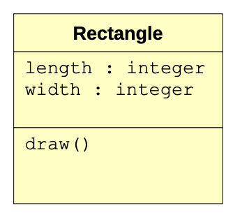
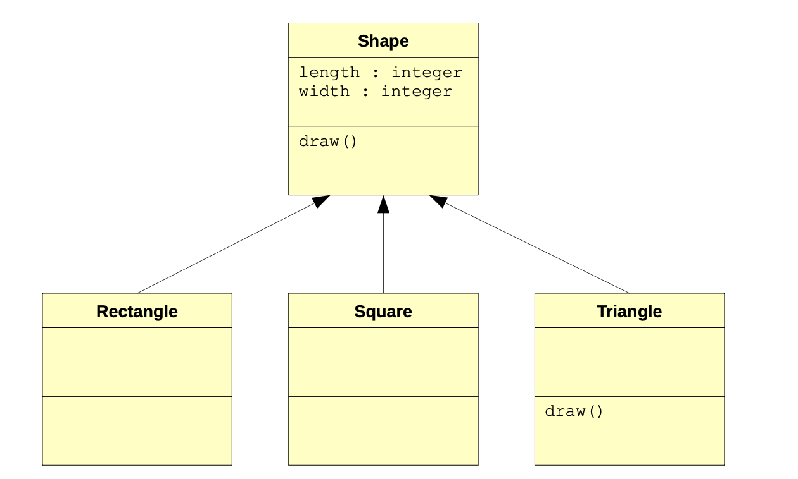
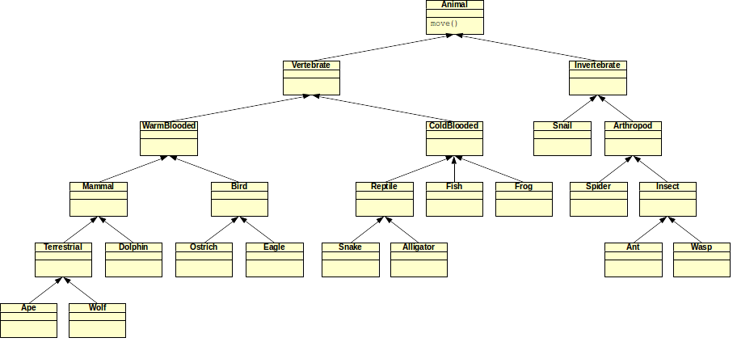

## Polymorphism

Let's go back to the mechanic's garage problem that was used earlier. Notice that all of the classes involved have their own `__str__` function. When we execute a statement such as `print(b1)`, which specific `__str__` function is executed?

::: {.callout-tip title="Definition"}
**Method lookup** solves the problem of finding the right method to call in a class hierarchy. The idea of having multiple methods with the same name in multiple classes is called **polymorphism**.
:::

At first, it may seem confusing to have multiple functions in different classes with the same name; however, it turns out to be a very handy feature of object-oriented programming. Let's answer the question that was initially posed: when we execute a statement such as `print(b1)`, which specific `__str__` function is executed? The variable `b1` is a bicycle. Therefore, if an `__str__` function exists in the Bicycle class, then it is executed. Indeed, one exists in the class. In fact, it contains the following single statement:

```python
return "Bicycle; " + super().__str__()
```

Note that the function also calls the `__str__` function in the `Cycle` class via the right-hand part of the statement: `super().__str__()`. The entire string cannot be returned until `__str__` in the `Cycle` class has finished execution. It, too, contains only a single statement:

```python
return super().__str__()
```

Clearly, it calls the `__str__` function in the `Vehicle` class, which returns a string containing the owner of the vehicle, its number of tires, and whether it has an engine or not:

```python
 return "owner={}, tires={}, engine={}".format(self.owner, self.tires, self.engine)
```

In the end, all three `__str__` output functions are executed with the statement `print(b1)`. What about the statement print(c1)? In a similar manner, we see that the `__str__` function in the `Car` class is executed first (since `c1` is an instance of the `Car` class). This function calls its matching function in the `Vehicle` class (in order to actually produce the string containing the car's owner, number of tires, and whether it has an engine or not).

In both of these examples, the function that is called is the one located in the object reference's defining class. That is, since `b1` is a bicycle, then the function in the Bicycle class is called. Similarly, since `c1` is a car, then the function in the `Car` class is called. The fact that there may be chained calls to matching functions in superclasses is just coincidence (however, it is intentional in order to produce the proper output).

Let's take a look at a slightly modified version of the previous example. First, the classes:

```python
class Vehicle:

    def __init__(self, name):
        self.tires = None
        self.engine = None
        self.owner = name

    def __str__(self):
        return "Vehicle; owner={}, tires={}, engine={}".format(self.owner, self.tires, self.engine)


class Car(Vehicle):

    def __init__(self, name):
        super().__init__(name)
        self.tires = 4
        self.engine = True


class Cycle(Vehicle):

    def __init__(self, name):
        super().__init__(name)
        self.tires = 2


class Bicycle(Cycle):

    def __init__(self, name):
        super().__init__(name)
        self.engine = False

    def __str__(self):
        return "Bicycle!"


class Motorcycle(Cycle):

    def __init__(self, name):
        super().__init__(name)
        self.engine = True

    def __str__(self):
        return "Motorcycle; " + super().__str__()


# main
c1 = Car("John")
c2 = Cycle("Samantha")
b1 = Bicycle("Jane")
m1 = Motorcycle("Randy")

print(c1)
print(c2)
print(b1)
print(m1)
```

This example has the same classes as the previous one. However, the `__str__` functions have been changed in various ways. 

::: {.callout-tip title="Activity"}
Given the discussion above about method lookup, can you explain what the print statements in the main part of the program will produce?
:::

Method lookup is essentially a simple concept. If a specified function is not found in a class, then a search for the matching function is performed in the superclass. In fact, method lookup works by continuously trying to find a matching function in the superclass hierarchy until one is found. If one is not found, then an error occurs.

Polymorphism is a powerful concept. It allows us to specify a function at a superclass level (including any desired implementation), and then to overwrite it at lower levels of the class hierarchy (i.e., in subclasses). Consider this a way to specialize or refine behaviors defined in superclasses.

Let's look at an example of how this can be leveraged to produce efficient programs. Consider a scenario in which you want to write a program that can draw basic shapes (e.g., a rectangle). Such a program can be designed by creating a rectangle class that stores its length and width in instance variables, and has a draw function that produces a representation of that shape (for now, just using characters that can be found on a keyboard). A simple class diagram for this could be the following:



And here's one possible method of implementing the class

```python
class Rectangle:

    def __init__(self, l, w):
        self.length = l
        self.width = w

    def draw(self):
        for i in range(self.width):
            print("* " * self.length)

r1 = Rectangle(10, 4)
r1.draw()
```

Lastly, here's the output produced by the program above:

```default
* * * * * * * * * *
* * * * * * * * * *
* * * * * * * * * *
* * * * * * * * * *
```

Sure enough, we asked for a rectangle that is 10 units long by 4 units high. And that's what we got! Now suppose that we want to expand the program to be able to accommodate squares. Squares are very similar to rectangles except that their length and width are always equal. Considering what we now know about inheritance and polymorphism, we could create a generic shape class that both squares and rectangles could inherit from.

Here's an updated version that implements this:

```python
class Shape:

    def __init__(self, l, w):
        self.length = l
        self.width = w

    def draw(self):
        for i in range(self.width):
            print("* " * self.length)


class Rectangle(Shape):

    def __init__(self, l, w):
        super().__init__(l, w)


class Square(Shape):

    def __init__(self, l):
        super().__init__(l, l)


r1 = Rectangle(12, 4)
r1.draw()
print()

s1 = Square(6)
s1.draw()
```

The `Square` and `Rectangle` classes are subclasses of the `Shape` class. Note that they have no instance variables or functions unique to them. That is, they inherit everything from their superclass. The only difference between the two is that the constructor of the `Square` class takes only one argument, while the constructor of the `Rectangle` class takes two arguments. Within their individual implementations, they both call the constructor of the `Shape` class.

When we want to draw a square or rectangle, we call the `draw` function. Method lookup makes it easy to see that the `draw` function in the `Shape` class will be executed. Why? Because the `Square` and `Rectangle` classes don't have a `draw` function of their own, but their superclass (the `Shape` class) does.

Since one of the benefits of inheritance is to increase code reuse and to ease expansion and application feature enhancement, let's do precisely that by adding the ability to create and draw triangles. To simplify this, let's just consider right-angled isosceles triangles (i.e., the two sides making up the right angle are of equal length). Since triangles are shapes too, it makes sense to make them a subclass of the `Shape` class, yielding the following modified class diagram:



Note the specification of the `draw` function in the triangle class. The shape of a triangle is different from that of a square or a rectangle, and the process of drawing that shape is therefore different. Polymorphism allows us to create another function, also called `draw`, but specifically for triangles. This overwrites the `draw` function specified in the `Shape` class, and effectively specializes the draw behavior for a triangle. This version of draw would only be executed on an object reference of the type `Triangle`.

Here is the new `Triangle` class, along with an updated main part of the program (note that the rest of the program that defines the other classes remains unchanged):

```python
class Triangle(Shape):

    def __init__(self, l):
        super().__init__(l, l)

    def draw(self):
        for i in range(self.width):
            print("* " * (self.width - i))


r1 = Rectangle(12, 4)
r1.draw()
print()

s1 = Square(6)
s1.draw()
print()

t1 = Triangle(7)
t1.draw()
```

The output of this modified program is as follows:
```default
* * * * * * * * * * * * 
* * * * * * * * * * * * 
* * * * * * * * * * * * 
* * * * * * * * * * * * 

* * * * * * 
* * * * * * 
* * * * * * 
* * * * * * 
* * * * * * 
* * * * * * 

* * * * * * * 
* * * * * *
* * * * *
* * * *
* * *
* *
* 
```

Pay close attention to the following statements in the draw function of the `Triangle` class:

```python
for i in range(self.width):
    print("* " * (self.width - i))
```

The variable `i` iterates from 0 through the width of the triangle (minus one). Since the triangle is seven units long, then `i` iterates from 0 through 6 (exactly seven times). The first time in the for loop, the variable `i` is equal to 0. Therefore, the number of asterisks displayed is `7 – 0 = 7`. The next time through the loop, `i` is equal to 1, and `7 – 1 = 6` asterisks are displayed. This continues until the last time through the loop, where `i` is equal to 6 and `7 – 6 = 1` asterisk is displayed.

### Acivity: Zooland

Now that you have an idea about polymorphism and method lookup, let's look at a hypothetical example in which we'll be more concerned about the placement of the polymorphic methods rather than their actual implementation.

Suppose that you are writing a program to model (i.e., programmatically represent) the types of animals that are in a zoo. Such a situation would easily lend itself to inheritance, since there are multiple animals that are similar in nature (and could therefore inherit similar traits from a superclass). In fact, a possible class diagram for such a program is shown on the next page.

The class diagram shows how a variety of animals are related. All animals move; therefore, a `move` function is defined in the topmost `Animal` class. That particular version of `move` is implemented as: “move in a given direction using four limbs, all of which are in contact with the ground at some point.”

Of course this definition of `move` is not accurate for some of the animals that are in the class diagram. The objective of this activity is to place one of the following alternate versions of `move` in the appropriate classes, such that all animals move in their proper way. Since the motivation behind inheritance is primarily to reduce code duplication, the goal is to place as few move functions in the hierarchy as possible. Here are the alternate versions of the `move` function:

1. Move in a given direction using four limbs, all of which are in contact with the ground at some point (note that this is the version in the animal class);

2. Move in a given direction using two limbs, both of which are in contact with the ground at some point;

3. Move in a given direction using wings or wing-like body parts;

4. Move in a given direction using six or more limbs, all of which are in contact with
the ground at some point;

5. Move in a given direction using fins or fin-like body parts; and

6. Move in a given direction by slithering on the ground.

Remember that the higher up a function is in the inheritance hierarchy, the more classes it can be applied to. In addition, it is possible that a better result is obtained by removing or changing the version of `move` currently in the `Animal` class to another version. Note that in cases where an animal could potentially implement more than one of the given versions of `move`, assume that the animal only uses the more dominant version. For example, while an eagle could walk on two limbs, it predominantly flies through the air to move; therefore, use version (3).



