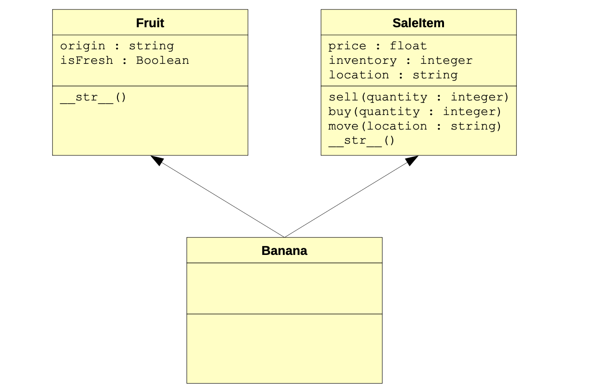

## Multiple Inheritance

In the previous lesson on the object-oriented paradigm, the concept of multiple inheritance (and how it differs from single inheritance) was briefly discussed. In this lesson, we have only looked at cases where a class only inherits traits from a single superclass. Most programming languages only support single inheritance; however, there are cases where it would be advantageous to support inheriting traits from more than one superclass.


::: {.callout-tip title="Defintion"}
**Single inheritance** is when a class inherits traits from a single superclass. **Multiple inheritance** is when a class inherits traits from two or more superclasses. Some languages only support single inheritance while others (such as Python) support multiple inheritance.
:::

To illustrate this again, consider the example used previously of a grocery store's items. A banana, for example, is a fruit. Therefore, it may inherit traits such as type and country of origin from a **Fruit** superclass. However, in the context of a grocery store, a banana is also an item for sale. Such a sale item may have a price, an inventory, and a shelf location, for example. Inheriting from both a **Fruit** superclass and a **SaleItem** superclass would then be useful in implementing the point-of-sale system for a grocery store. Here's a class diagram that illustrates this:



To declare a class as having more than one superclass, we simply put the names of its superclasses (each separated by a comma) in the parentheses following its class name. Here's an example with the banana class:

```python
class Banana(Fruit, SaleItem):
    ...
```

Method lookup in the context of multiple inheritance raises an interesting question: which function is called if more than one superclass has a function with the same name? For example, the `Banana` class does not have the `__str__` function as shown in the class diagram; however, both the Fruit and `SaleItem` classes do. So which of the two `__str__` functions is executed supposing some print statement on an object reference of the `Banana` class is executed?

Since the `Banana` class has no `__str__` function, then the normal behavior is to find the matching function in the superclass. However, the banana class has two superclasses. With multiple inheritance, method lookup is carried out in the order in which the superclasses are listed in the class arguments. In the `Banana` class header shown above, for example, the matching function would first be searched for in the `Fruit` class since it is the first superclass listed. If found (which it clearly is), it is executed; if not, then the matching function would be searched for in the `SaleItem` class. If found, it would be executed; if not, an error would occur (since the method would never have been found).

