## Signed Magnitude Notation

An early attempt to handle signed numbers was to add a special sign bit to the left of each number. A zero in the sign bit was used for positive numbers, and a one in the sign bit was used for negative numbers. The representations of +5 and -5 in **signed magnitude notation** are shown below. These representations assume that three bits are reserved for the magnitude of a number and one bit for its sign:

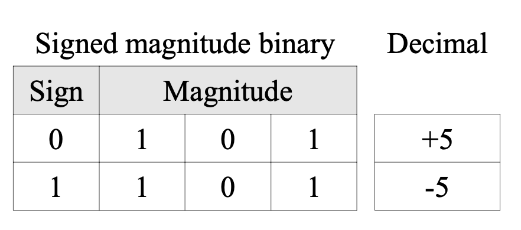{width="375" fig-align="center"}

Signed magnitude notation works, provided that the sign bit is treated separately from the magnitude of the number and guides how arithmetic operations are performed. However, arithmetic in this notation is difficult and results in some anomalies. For example, there are two representations for zero (+0 is 0000 and -0 is 1000). To illustrate the difficulties in arithmetic, let's look at the sum of +5 and -5 (which should be 0):

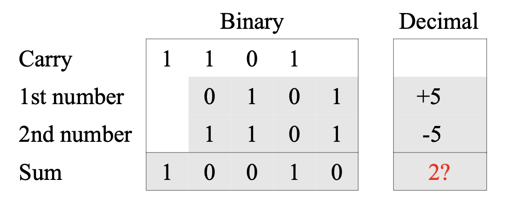{width="375" fig-align="center"}

Note that the sum (10010) does not equal 0 (0000 or 1000) using signed magnitude notation (even if we ignore the leftmost bit). Arithmetic becomes easier, however, if we write a negative number as the complement of the corresponding positive number. 

## One's Complement

The complement of a binary number is formed by writing a 0 wherever there is a 1 in the original number, and a 1 wherever there is a 0 in the original number. As with signed magnitude notation, the leftmost bit still indicates the sign of the number: 0 for positive numbers, and 1 for negative numbers. Complementing a binary number in this way to represent signed values is sometimes referred to as **one's complement notation**. The one's complement representation of +5 and -5 are shown below:

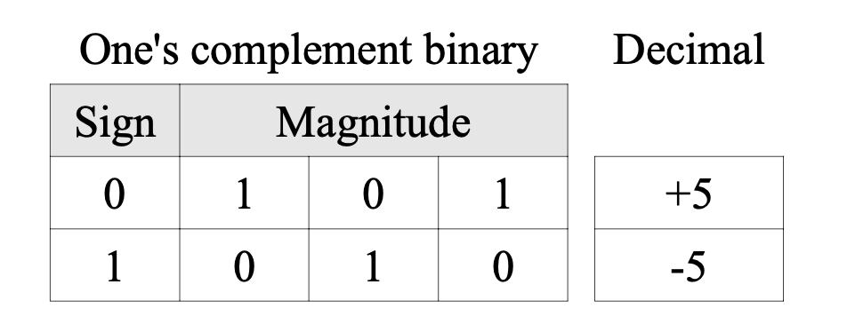{width="375" fig-align="center"}

Although the arithmetic for one's complement numbers is much easier than for signed magnitude numbers, the anomaly of two representations for zero (0000 for +0 and 1111 for -0) still exists. Let's see how +5 and -5 can be added using one's complement notation:

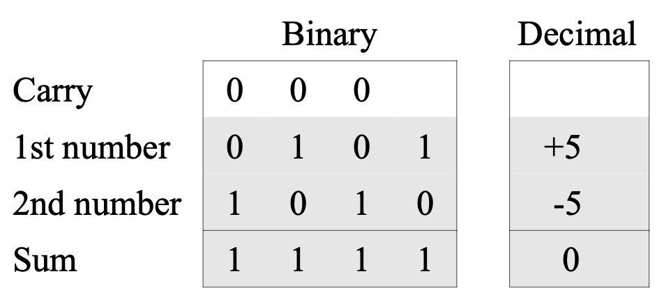{width="375" fig-align="center"}

Indeed, the result (1111) is 0 (well, one variation of it: -0).

## Two's Complement

**Two's complement notation** is a variation of one's complement notation that only includes a single representations for 0. To change the sign of a two's complement binary number, we perform the following three steps:

1. Write down the binary representation of the original number;

2. Complement all of the bits (i.e., replace 1's with 0's and 0's with 1's); and 

3.  Add one to the result.

Here are +5 and -5 written in two's complement notation:

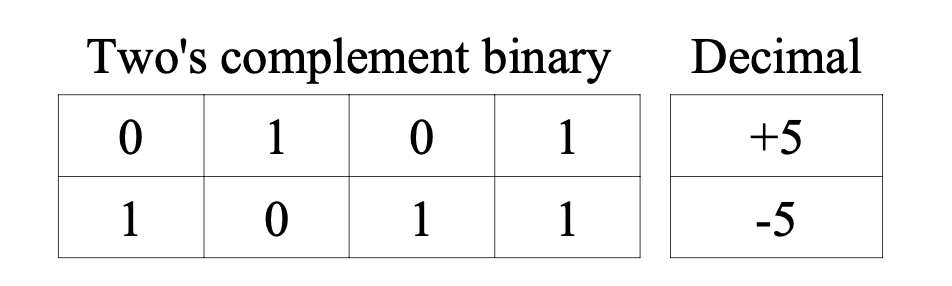{width="375" fig-align="center"}

Let's see how +5 and -5 can be added using two's complement notation:

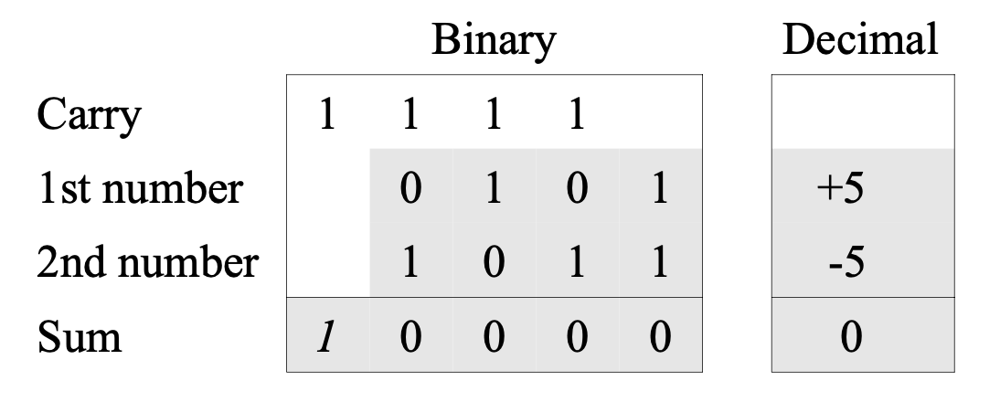{width="375" fig-align="center"}

Notice that while we get a correct answer (0000), this problem also generated a carry bit (the italicized leftmost 1). We will discuss this anomaly later. While the idea of two's complement notation may seem a little strange at first, it has a unique representation for zero (0000, given four bits) and straightforward arithmetic operations. Notice that, for positive numbers, all three representations (signed magnitude, one's complement, and two's complement) have the same pattern as unsigned numbers.

The following table presents the sixteen signed numbers that can be represented using two's complement notation and four bits of storage. Notice that the numbers range from negative eight to positive seven. In two's complement notation, the range of numbers that can be represented given a fixed number of bits will always include one more negative value than there are positive values. This is because the representation of zero includes a 0 in the leftmost bit position, thus taking up one of the “positive” slots.

/// a table goes here, cant do the image

For n bits of storage the range of numbers that can be represented in two's complement notation extends from $−2n−1$ to $+2n−1−1$ . In the table above, four bits of storage were used; therefore, the range of numbers was from $−24−1 = −23 = −8$ to $24−1−1 = 23−1 = 7$. Most modern computers use 32 bits to represent integers. Thus, they are capable of representing values in the range $−231 = − 2,147,483,648$ to $231−1 = 2,147,483,647$.

What do you suppose happens if 1 is added to 7? In other words, how does the computer handle 0111 + 0001? Performing binary addition, the result is 1000. In the table, this is -8! Does this mean that 7 + 1 = -8? If the computer stored integers using only four bits, then indeed this would be the case! Counting essentially wraps around the table. That is, 7 + 1 = -8 and -8 – 1 = 7. The four bits of storage only allow numbers in this range.

In order to understand why two's complement is the preferred method for representing signed numbers at the machine level, we will look at a number of addition problems involving both positive and negative numbers. As we will see, what makes two's complement so great is that the sign of a number can essentially be ignored when performing addition (since positive and negative numbers are treated in an identical manner). An added bonus is that we get the subtraction operations for “free” once we have addition: a problem such as X – Y can be recast as the following two step process:

1. Swap the sign of Y 

2. Add X and Y.

Let's begin by examining the summation of numbers with opposite signs. First, the sum of +2 and -3 (which should sum to -1). Assuming four bits of storage, the two's complement binary representation of +2 is 0010. The two's complement representation of -3 is 1101. Why? To obtain -3, we begin with +3 (0011), complement the bits (1100), and add one (1101). Here's the addition of +2 and -3:

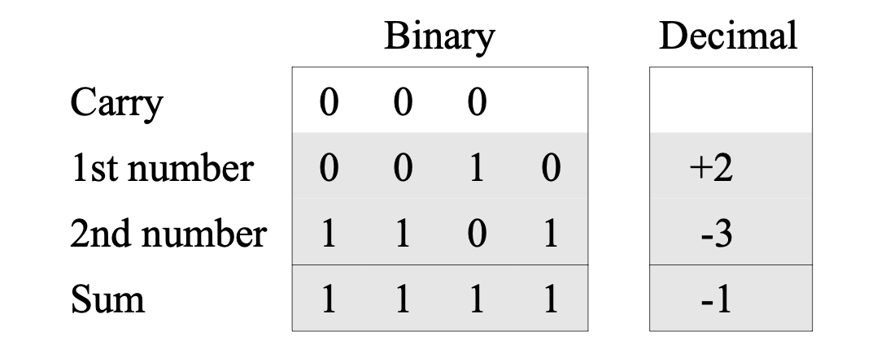{width="375" fig-align="center"}

The 1 in the leftmost column of the result tells us that the number is negative. Its magnitude can be determined by complementing each bit (0000) and adding one (0001). Thus, the addition of +2 and -3 is 1111 (or -1).

Next, let's look at the addition of -2 and +3. The two's complement binary representation of -2 is 1110 (start with +2 which is 0010, complement the bits to obtain 1101, and add one to obtain 1110). The representation of +3 is 0011. Adding these two values together gives +1 or 0001 in binary two's complement, as is illustrated below:

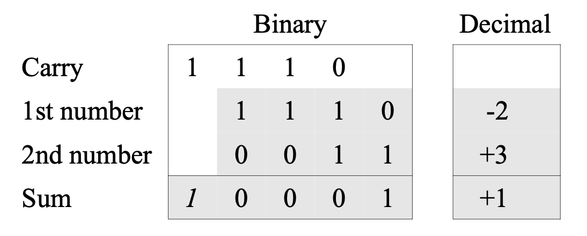{width="375" fig-align="center"}

Note that this particular addition of two four-bit numbers results in a carry to a fifth bit. We saw this before (when adding +5 and -5). This carry is ignored. In order to reinforce the fact that this bit is discarded, it is shown in italics.

## Overflow

Let's now turn our attention to addition problems involving numbers of the same sign. Here is an illustration of the addition of two positive numbers: +2 (0010) and +3 (0011):

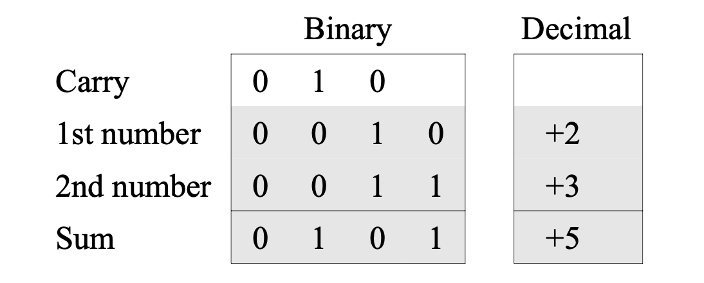{width="375" fig-align="center"}

To show that the system handles the addition of negative numbers properly, consider adding -2 (0010 → 1101 → 1110) and -3 (0011 → 1100 → 1101). The result should be -5 (0101 → 1010 → 1011):

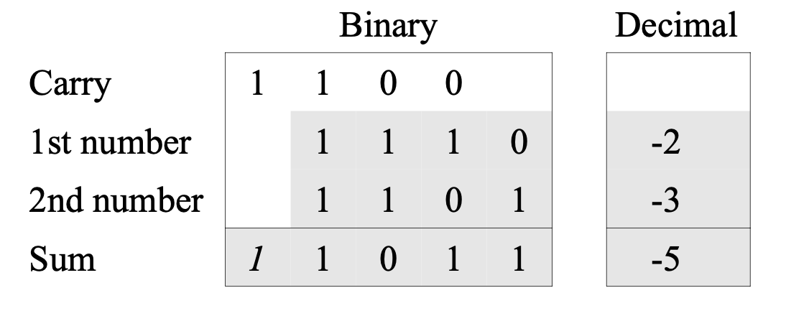{width="375" fig-align="center"}

The result is indeed 1011. The 1 in the leftmost bit indicates that the result is a negative number. We can determine its magnitude by implementing the two's complement operations on it: complement the bits 1011 to obtain 0100, and add one to obtain 0101.

Notice that while we get a correct answer, this problem also generated a carry bit that is discarded. One problem that can arise when representing numeric values via a fixed number of bits is the problem of overflow.

::: {.callout-tip title="Defintion"}
**Overflow** occurs when the value that is to be stored is outside the range of permissible values (i.e., the value is too large to fit in the available space).
:::

The only way around overflow is to add more bits to the representation, thus increasing the range of permissible values. The best we can do in place of this is to detect when overflow occurs.

Two's complement notation makes it easy to spot when overflow occurs: when two numbers of the same sign are added together and the result has the opposite sign. Here are two examples; first, the sum of +4 and +5 (which are both positive numbers):

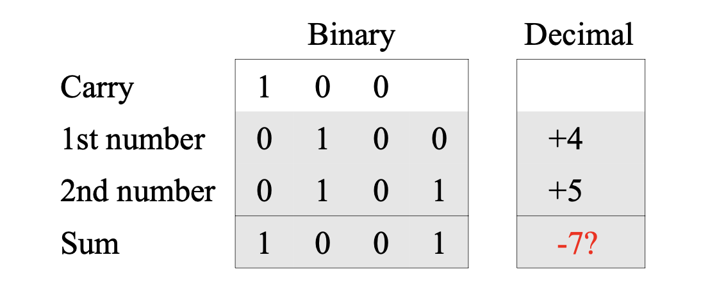{width="375" fig-align="center"}

Clearly, the result is not -7. Note that the result (-7) has a different sign than the two numbers (+4 and +5). Here's another example:

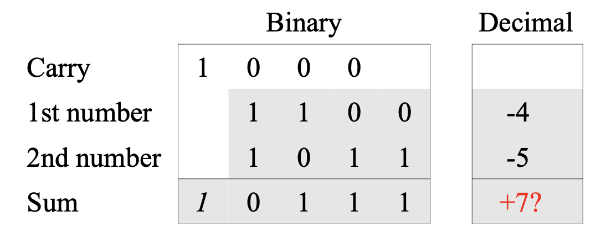{width="375" fig-align="center"}

Overflow in two's complement can be spotted when the sign bits of both numbers being added are the same, yet the sign bit of the answer is different. Note that overflow can only occur when adding numbers of like sign. It can never occur when numbers of opposite signs are added.

When an overflow is detected, the answer is incorrect, as shown above by the question marks, and must be discarded. There is no way to get the correct answer if the number of bits available does not allow us to express that answer. There is no way to express +9 or -9 (the correct results to the examples above) using a four-bit two's complement number, since both are outside the range of permissible values.

