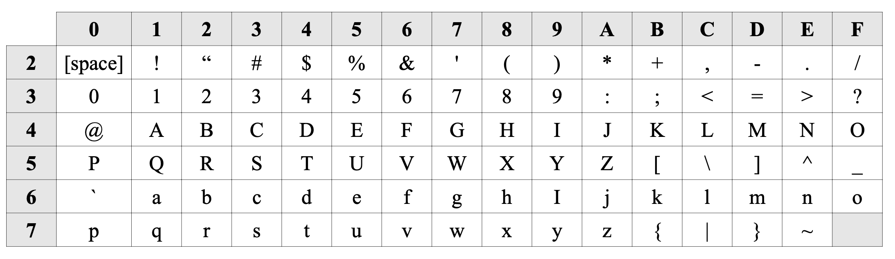

We now turn our attention to representing characters at the machine level. One of the most popular methods of representing character data in a computer is to use the ASCII character set. The basic idea behind **ASCII** (American Standard Code for Information Interchange), and in fact all other character sets, is to associate particular bit patterns with individual characters.

There are 128 symbols in the standard ASCII character set. These are numbered from 0 to 127. ASCII characters are grouped together in the following way:

| Character group           | Decimal   | Hexadecimal |
|:---                       |:---:      |:---:        |
| Control characters        | 0 – 31    | 0 – 1F      |
| Punctuation               | 32 – 47   | 20 – 2F     |
| Digits                    | 48 – 57   | 30 – 39     |
| More punctuation          | 58 – 64   | 3A – 40     |
| Uppercase letters         | 65 – 90   | 41 – 5A     |
| More punctuation          | 91 – 96   | 5B – 60     |
| Lowercase letters         | 97 – 122  | 61 – 7A     |
| More punctuation            | 123 – 126 | 7B – 7E     |
| One final control character | 127     | 7F          |

Control characters refer to *nonprinting* characters (e.g., return/enter, linefeed, delete, and so on). Punctuation refers to any printable character that is not a digit or letter (e.g., [, {, |, \\, and so on).

The following table contains the hexadecimal representations of all of the printable ASCII characters. These range from the space character (with an ASCII value of $20_{16} = 32_{10}$) to the tilde (with an ASCII value of $7E_{16} = 126_{10}$). The ASCII value for a character may be found in the table below by locating the row and column in which the character appears. The row specifies the high-order (leftmost) hexadecimal digit, and the column specifies the low-order (rightmost) hexadecimal digit. For example, the ASCII value for the uppercase letter H is $48_{16}$, since it appears in row 4 and column 8. To determine the decimal version of the ASCII value, you must perform the conversion from hexadecimal to decimal (e.g., $48_{16} = 72_{10}$).

While any assignment of bit patterns to characters would accomplish the primary task of enabling computers to store character data, a lot of thought went into the design of ASCII. For example, uppercase and lowercase characters differ in ASCII by exactly one bit (e.g., $A = 41_{16} = 01000001_2$, and $a = 61_{16} = 01100001_2$). Therefore, any lowercase character can be changed to upper case by simply setting bit six to 0. Conversion from uppercase to lowercase is just as easy: set bit six to 1!
The concept of mapping characters to bit patterns is logical; however, characters typed on a keyboard don't show up on the screen as ASCII values. This is because ASCII values are hidden from the computer user. When you type “patootie” on your keyboard, you first hit a key marked “p”. This causes the keyboard circuitry to generate the ASCII code 7016. Next, you strike the key marked “a”, causing the keyboard circuitry to generate the ASCII code 6116. This process occurs for the entire word. The display circuitry built into your computer’s video card then displays the characters of the word as it receives the ASCII values for each character. Since the internal circuitry of both the keyboard and video card handle the translation and processing of ASCII values, you never see the ASCII values.

It is interesting to note what happens when the shift key is held down as, for example, the word “patootie” is typed. What the shift key actually does (at least for the keys marked with letters of the alphabet) is to set bit six to 0. Thus, the combination of shift and p (which is $70_{16} = 01110000_2$) produces $50_{16} = 01010000_2$ (which is the ASCII value for P).

