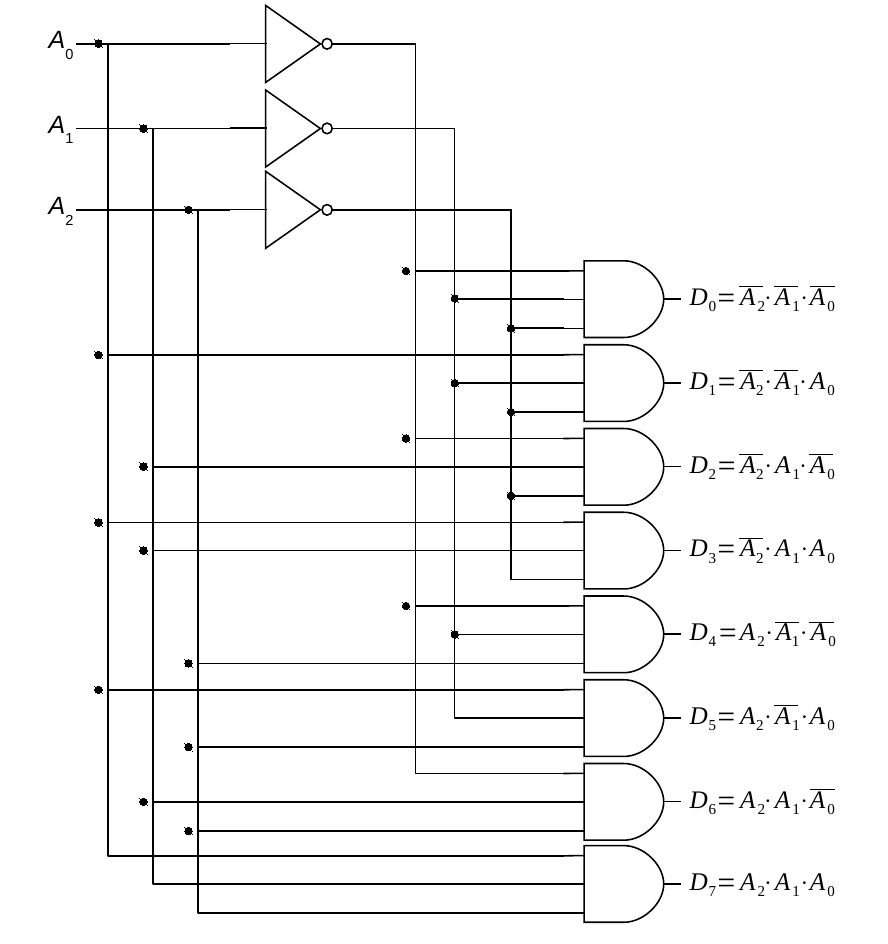
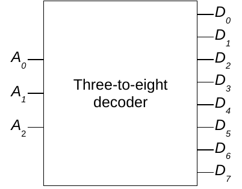
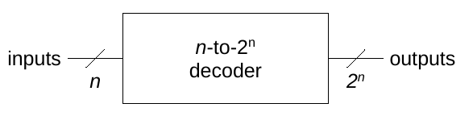
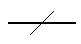
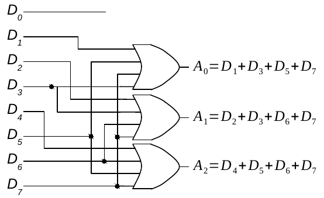
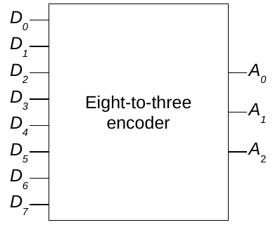
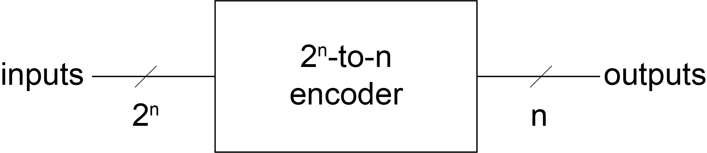

Recall that combinational circuits are digital circuits that do not involve any kind of feedback. In other words, the output of a combinational circuit cannot be fed back into that circuit as input. Previously, only three types of combinational circuits were covered: the *xor* gate, comparators (for equality, less than, and greater than), and adders (half adder, full adder, chaining full adders). There are several more types of combinational circuits that are important, particularly in the design of computers.

## Decoders

::: {.callout-note appearance="minimal"}
**Definition**: A **decoder** is a type of circuit that takes in a number (in unsigned binary form) and generates a 1 (high) on the output line that corresponds to the input number. All other output lines are set to 0 (low).
:::

For example, given an input of 00~2~, a 1 would be generated on output line zero. Likewise, given 01~2~ as input, a 1 would be placed on output line one. You will see later how decoders form an integral part of memory and register addressing circuitry.

Every decoder with *n* input lines will have exactly 2^n^ output lines. Therefore, a *two-to-four* decoder will have *two* input lines and *four* output lines, while a *three-to-eight* decoder will have *three* input lines and *eight* output lines. Both the input and output lines of decoders are numbered, with the *n* inputs ranging from 0 to *n*-1, and the 2^n^ outputs ranging from 0 to 2^n^ − 1. 

Here is the truth table for a two-to-four decoder:



Here is the truth table for a three-to-eight decoder:



The inputs are labeled A~0~ to A~2~ and represent the bits of a three-bit unsigned binary number. The outputs are labeled D~0~ through D~7~. As the table shows, an input number (such as 110~2~ = 6~10~) results in the corresponding data line (D~6~ in this case) being set to 1, with all other lines held at 0.

The following circuit illustrates an implementation of a three-to-eight decoder. The circuit diagram uses eight three-input *and* gates (one for each data line), together with a total of three *not* gates. If you don't happen to have access to three-input *and* gates, remember that they can easily be constructed from two standard two-input *and* gates.

Carefully tracing the lines in the circuit diagram, we see that all three of the inputs to the D~0~ *and* gate are negated. Thus, when inputs A~2~, A~1~, and A~0~ each have a value of 0, D~0~'s three-input *and* gate receives three 1s (i.e., *not* A~2~, *not* A~1~, and *not* A~0~) and generates a 1 as output. The result is that a 1 (high) is placed on output line zero when the number 000~2~ is given as input to the circuit.

Let's continue to the *and* gate for D~1~. Note that two of the three inputs (A~2~ and A~1~) are negated, but the third input (A~0~) is not. Thus, when inputs A~2~ and A~1~ are 0, but A~0~ is 1 (corresponding to the input number 001~2~ — or 1~10~) the *and* gate will receive three 1s and generate a 1 on line D~1~. Skipping ahead to the final case, note that the three-input *and* gate for D~7~ receives all of its inputs directly from A~2~, A~1~, and A~0~ without negation. Thus, when A~2~, A~1~, and A~0~ each contain 1 (corresponding to the number 111~2~ — or 7~10~) the gate will generate a 1 on data line D~7~. The other cases are handled in a similar manner.

The three-to-eight decoder may be encapsulated using a "black box" as follows. 

In general, since an *n* input decoder will always have 2^n^ outputs, its "black box" can be expressed using the *n*-to-2^n^ notation shown below.

The following symbol (along with a number or variable) is frequently used as a shorthand in circuit design to represent the indicated number of lines without actually drawing them. Since modern computers are based on 32-bit buses, this compact representation is very important.

## Encoders

It is natural to wonder at this point if there is a circuit that does the exact opposite of a decoder. Of course there is!

::: {.callout-note appearance="minimal"}
**Definition**: An **encoder** is a type of circuit with 2^n^ input lines, only one of which can be high at any given time, that produces an *n*-bit unsigned binary number that corresponds to the raised input line.
:::

A four-to-two encoder is defined by the following truth table:



Note that twelve of the sixteen rows of the truth table are invalid. These rows represent input configurations that are disallowed because either no input line is high, or multiple input lines are high. In these cases, there is no single high input line for the circuit to return the corresponding binary number of.

How are we to deal with these *undefined* configurations when constructing the corresponding circuit? One way is to simply ignore the disallowed input configurations. This approach will work fine as long as we can be *sure* that the illegal states can never occur.

The following presents an implementation of an eight-to-three encoder that assumes that disallowed states will never be encountered. The circuit works fine as long as this limitation is respected. For example, placing a 1 on line D~6~, while holding all other lines low, causes the number 110~2~ (or 6~10~) to be generated. An invalid configuration of inputs generates an erroneous output. For example, setting both D~1~ and D~2~ to 1 causes the circuit to output 011~2~ (or 3~10~).

One odd feature of this circuit is that input line D~0~ is not connected to anything. It is, in a sense, ignored. Although this may seem strange at first, it is precisely what we want the circuit to do. Setting line D~0~ to 1 (and all other input lines to 0) is supposed to cause all of the output lines to be set to 0 in order to represent the number 000~2~.

The truth table for the eight-to-three encoder would be similar to the one shown above for the four-to-two encoder. However, the full truth table would consist of 256 rows (since it has eight input lines and therefore 2^8^ = 256 possible input configurations). All but eight of these input configurations would be disallowed. In order for the circuit's truth table to fit on a page, only the allowed rows are presented below:



As you can see, this truth table is the exact inverse of the truth table for the three-to-eight decoder presented earlier. The eight-to-three encoder can be encapsulated into a "black box" as follows. In general, a 2^n^ to *n* encoder can be drawn as shown below.

{width=75%}
