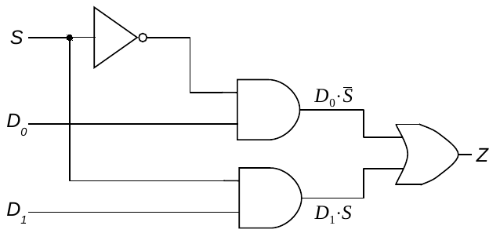
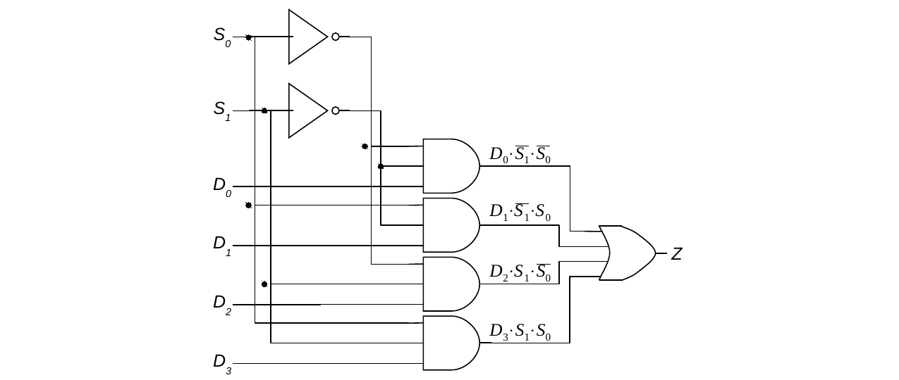
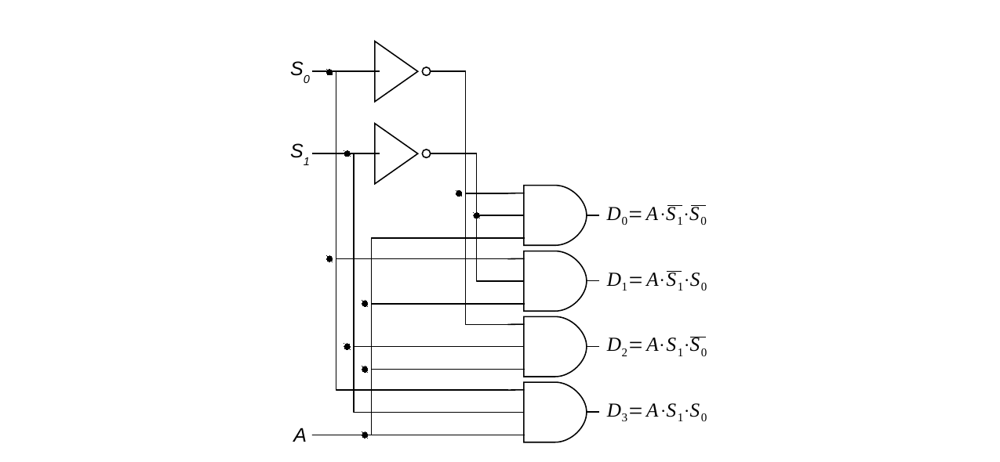
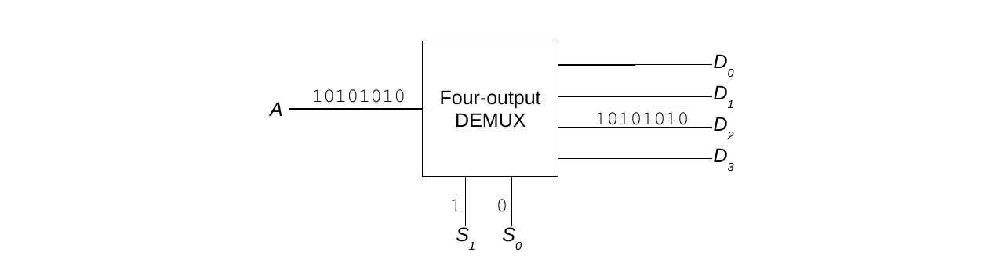

## Multiplexers

::: {.callout-note appearance="minimal"}
**Definition**: **Multiplexers** are circuits that are used to transfer the contents of an input data line to an output line based on the value of one or more input selector lines.
:::

While that definition sounds a bit intimidating, multiplexers really aren't that complex. Essentially, a multiplexer is a kind of switch. It has two types of inputs: data lines and selector lines; it has a single output line. The purpose of a multiplexer is to transfer the contents of one of the input lines to the circuit's single output line. The values placed on the selector lines determine which data line will have its contents transferred to the output line. Thus, the selector lines allow the multiplexer circuit to switch its "attention" between the various input data lines when determining the value to be output.

Generally, a multiplexer (MUX) will have 2^n^ data lines for *n* selector lines. The data lines are numbered 0 to 2^n^ − 1, and the selector lines are numbered 0 to *n* − 1. The bit pattern placed on the selector lines, when interpreted as an unsigned binary number, determines the active data line. Therefore, an eight-input MUX will have eight data lines and three selector lines, while a two-input MUX will have two data lines and a single selector line. Remember that, regardless of the number of input data and selector lines, every MUX has only one output line.

The following presents an implementation of a two-input multiplexer. It has two data lines, one selector line, and a single output. When the selector line, S, is set to 0, the current value of D~0~ (either a 1 or a 0) becomes the output of the circuit, regardless of the value of line D~1~. The circuit is, in a sense, *listening* to D~0~ and ignoring D~1~. When S is 1, the opposite situation exists: the output of the multiplexer becomes the current value of D~1~, and D~0~ is ignored.

The behavior of the two-input multiplexer is summarized in the following truth table:



The following illustrates a somewhat more complex multiplexer, a four-input MUX. It has two selector lines, four data lines, and a single output line. Placing a 0 on both S~1~ and S~0~, corresponding to 00~2~, causes the value of D~0~ to be transferred to the output line. Setting S~1~ to 0 and S~0~ to 1, corresponding to 01~2~, causes D~1~ to be transferred to the output line. Likewise, setting S~1~ to 1 and S~0~ to 0, corresponding to 10~2~, causes D~2~ to be transferred to the output line. Finally, setting S~1~ to 1 and S~0~ to 1, corresponding to 11~2~, causes D~3~ to be transferred to the output line:

An inspection of the circuit diagram for the four-input MUX reveals that it contains four three-input *and* gates, two single-input *not* gates, and one four-input *or* gate. Each *and* has one of the data lines running into it, plus two selector signals. Some of the selector signals have been routed directly from the selector input lines, while others have been negated before being sent on to the *and* gates. The outputs of all four of the *and* gates are routed into the four-input *or*. The output of this *or* becomes the output of the MUX circuit. If any one of the *and* gates generate a 1, the circuit will output a 1. If all of the *and* gates produce 0, the circuit will output a 0.

In order to better understand the behavior of this multiplexer, let's examine the conditions under which each of the *and* gates could fire. A three-input *and* gate can produce a 1 only if all of its inputs are 1. Thus, the two selector signals and the data value reaching the *and* gate must be 1 for that gate to generate a 1.

The selector signals reaching the gate that is connected to D~0~ are *not* S~1~ and *not* S~0~. This gate can produce a 1 only when S~1~ = 0, S~0~ = 0, and D~0~ = 1. Under any other circumstances (e.g., if D~0~ is 0 or if either S~1~ or S~0~ is 1) this *and* gate produces a 0. Hence, this part of the circuit faithfully transfers the value of D~0~ when the S~1~,S~0~ bit pattern is 00. Just as importantly, this *and* gate stays low when the selector bit pattern is not 00, regardless of the value of D~0~.

The other *and* gates act in a similar manner. The gate for D~1~ is attached to *not* S~1~ and S~0~; therefore, it only generates a 1 when S~1~ = 0, S~0~ = 1, and D~1~ = 1. Other selector bit patterns keep it low. The *and* gate that receives the D~2~ signal is connected to S~1~ and *not* S~0~. This gate produces a 1 only when S~1~ = 1, S~0~ = 0, and D~2~ = 1. It generates a 0 at all other times. Finally, the *and* gate for D~3~ is attached directly to S~1~ and S~0~. Thus, it generates a 1 when S~1~ = 1, S~0~ = 1, and D~3~ = 1.

Because of the way the selector signals are routed to the various *and* gates, it is impossible for more than one of them to produce a 1 at the same time. For this reason, the results of the *and* gates can be safely combined via an *or* gate without worrying that signals from multiple data lines will be accidentally combined.

The four-input multiplexer can be represented by a "black box" as follows:

The following figures illustrate the behavior of the four-input MUX over time. The input lines and output lines are labeled with the data streams flowing down them. During the period of time illustrated in the following figure, selector lines S~1~ and S~0~ are both held at zero, making D~0~ the *active* data channel:

In the following figure, S~1~ is held at zero and S~0~ at one, thereby activating D~1~:

While the selector lines are held steady, the current state of each of the data lines varies over time as data moves across the lines (from left-to-right; therefore, the data on the lines is read from right-to-left). For example, in both of the previous figures, line D~0~ first contains a 0, then its value changes to 1, then back to 0, then to 1, then 0, then 1, and so on. Line D~1~ begins by broadcasting four consecutive 1s followed by four consecutive 0s. Notice that when D~0~ is active (i.e., S~1~ = 0, S~0~ = 0), its bit pattern, 01010101, is copied to the output channel. Likewise, when D~1~ is active (i.e., S~1~ = 0, S~0~ = 1), its bit pattern, 11110000, is copied to the output channel.

## Demultiplexers

Just as with the decoder above, the multiplexer has an exact opposite circuit: the demultiplexer (DEMUX).

::: {.callout-note appearance="minimal"}
**Definition**: A **demultiplexer** has a single data input line, *n* selector input lines, and 2^n^ output data lines. Demultiplexers generate a copy of their input data value on the output data line specified by their selector lines.
:::

As was the case with multiplexers, the *n* selector lines are numbered from 0 to *n* − 1, and the 2^n^ output data lines from 0 to 2^n^ − 1.

Demultiplexers are often referred to using their number of output lines. The following illustrates an implementation of a four-output demultiplexer:

The value of the input data line labeled A is transferred to one of the output data lines, D~0~ through D~3~, based on an interpretation of the bit pattern in S~1~,S~0~ as a two-bit unsigned binary number. For example, if S~1~ = 1 and S~0~ = 0, corresponding to 10~2~ (or 2~10~), then the current state of the input line would be transferred to D~2~. The design of this circuit is quite similar to the one used for the decoder circuit shown earlier. The only difference is that a copy of the input data value is routed to each of the *and* gates so that, instead of simply setting the selected output line high, its value will instead be determined by the input data value.

The following is a "black box" representation of the four-output demultiplexer:

The following figures illustrate the behavior of the four-output DEMUX over time. The input lines and output lines are labeled with the data streams flowing down them. During the period of time illustrated in the following figure, selector line S~1~ is held at one and S~0~ is held at zero, making D~2~ the active data channel:

In the following figure, S~1~ and S~0~ are both held at one, activating D~3~:

These examples illustrate how a demultiplexer can *broadcast* an input data stream down one of many different output channels. Changing S~1~,S~0~ changes the broadcast to a different output channel.
