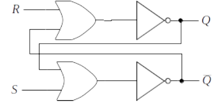
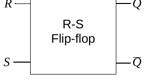
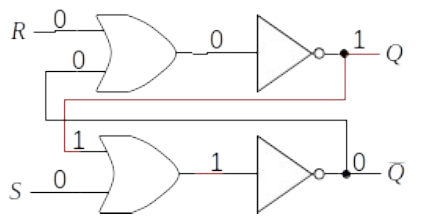

## Sequential Circuits

All of the circuits discussed up to this point have been combinational circuits whose outputs depended solely on their inputs. Such circuits do not incorporate feedback and have no "memory" of their previous state. In order to construct a general-purpose computer, circuits capable of remembering instructions, data, and the results of computations are needed.

It is possible to design circuits that exhibit memory by incorporating feedback, in the sense that the outputs of a circuit can be made to depend not only on the circuit's current inputs, but also on its past outputs as well. Such circuits are referred to as **sequential circuits**, since their output may be viewed as a function of a sequence of past inputs.

::: {.callout-note}
# Sequential Circuits
**Definition**: *Sequential circuits* have memory because one or more of their outputs are fed back to serve as input. Therefore, a sequential circuit's next output will, in a sense, be a function of its present inputs and its previous outputs.
:::

::: {.callout-note}
# Flip Flops
**Definition**: The term *flip-flop* is a generic term applied to devices having two stable states.
:::

The primary function of a flip-flop is to store a binary digit, 0 or 1. Therefore, a flip-flop can be used to implement the most basic unit of memory, the bit. A flip-flop is implemented as a set of logic gates that make use of feedback to remain in one of two stable states, thereby *remembering* a binary digit.

## The R-S Flip-Flop

An R-S flip-flop can be constructed from two interconnected *nor* gates. The following figure illustrates such an R-S flip-flop. As discussed in a previous lesson, a *nor* gate is simply an *or* gate followed by a *not* gate. For clarity, the following figures shows the two *nor* gates of the flip-flop as having been decomposed into their underlying *or* and *not* gates:

Here's a "black box" representation of the R-S flip-flop:

R-S flip-flops have two inputs and two outputs. The inputs are usually labeled R for **Reset** and S for **Set**. The outputs are traditionally labeled Q and Q̄ (*not* Q). Q̄ is the complement (or opposite) of Q; therefore, if Q is 1 then Q̄ should be 0 (and vice versa). The Q output of the flip-flop determines its state. In other words, examining the Q output is the same as seeing what is stored in the bit. The state can be a binary 1 (Set) or a binary 0 (Reset). When a flip-flop is in the Reset (0) state, Q is 0 and Q̄ should be 1. The ability of a flip-flop to hold the Q output constant until a signal is given to change the state is what makes flip-flops considered basic memory devices.

We begin our detailed analysis of the R-S flip-flop assuming that Q is initially high (1), and both R and S are low (0), as shown in the following figure. Since both of the inputs to the top *or* gate are 0, its output is low; and the output of the top *not* gate is high. This high output is fed back into the bottom *or* gate, making its output high and the output of the bottom *not* gate low. While R and S remain low, Q will continue to hold the value 1. The bit is thus holding a 1:

If we apply a 1 to R in order to place a 0 into the bit (Q), the following events occur: (1) the output of the top *nor* gate (the Q signal) goes low; (2) this is fed back to the input of the bottom *nor* gate, which causes its output (the Q̄ signal) to go high; and (3) this signal is fed back to the top *nor* gate, but since it already has another high input, there is no change in the output (i.e., it remains low). This is a stable circuit, as shown in the following figure (note that the flip-flop has been reset to 0):

If R is set to low, the flip-flop remains in the Reset (0) state since there is still a 1 input to the top *nor* gate from the Q̄ input. This is shown in the following figure. Note that this is exactly the behavior we desire. In order for the flip-flop to be useful, it must be able to *remember* that it has been reset to 0 even after the reset signal is removed:

Next, we apply a high signal to the S input in order to set the bit to 1. This action causes the following events to occur: (1) the output of the bottom *nor* gate becomes 0 since one of its inputs is now high; (2) this low signal is applied as an input to the top *nor* gate, where the R input is also low; and (3) the output of the top *nor* is forced high, and this high output is fed back into the bottom *nor* gate, which does not change its state (since its other input was already high). The flip-flop has been set to 1, as can be seen in the following figure:

Next, we remove the Set signal. In other words, we change the S input to low. This action does not change the output of the bottom *nor* gate since its other input is already high and the circuit remains in the set state. This is shown in the following figure. Note that this is exactly the behavior we desire. Once an R-S flip-flop receives a pulse (or 1) down its set line, it will continue to hold that 1 until a reset signal (i.e., 1 down the reset line) is received:

Notice that state of the flip-flop shown above is identical to its original state (shown at the very beginning of these examples). They both represent the flip-flop in the Set (1) state, with S set to 0 on both inputs. Comparing the figures to one another illustrates another feature of flip-flops: the value output by the circuit is not solely dependent on its current inputs. When the R and S inputs are both 0, the value output on the Q line depends on whether the most recent 1 input was on the set line or the reset line.

There is one other possible configuration of inputs we have not yet considered. What happens if both the R and S inputs are set to high at the same time (corresponding to an attempt to simultaneously store both a 0 and a 1 into a single bit)? This is pictured in the following figure. The outputs do remain constant, but the R-S flip-flop is not in a valid state because Q and Q̄ have identical values, yet they are always supposed to be the opposite of one another:

To conclude the introduction to the R-S flip-flop, here is its truth table:



## The Clocked R-S Flip-Flop

::: {.callout-note}
# Clock
**Definition**: A *clock* is a device that generates a signal that periodically cycles between a high state and a low state.
:::

Clocks ensure that the operations performed by a computer proceed in an orderly manner. They do so by enabling certain operations to occur only at specific points in time.

Clocks divide time into **cycles** that consist of two phases: a high phase and a low phase.

::: {.callout-note}
# Clock Cycle
**Definition**: A *clock cycle* is defined as the interval of time beginning when the clock goes to a high state, lasting through the return to a low state, and ending with the start of the transition back to the high state again.
:::

The following figure illustrates four complete cycles of a clock:

Each clock cycle lasts for only a brief instant of time. The CPU of a modern PC, for example, runs at billions of clock cycles per second (or gigahertz). The clock speeds of other components, such as the system bus, are usually somewhat slower but still in the range of hundreds of millions of clock cycles per second (or megahertz). The various operations that a computer can perform require one or more clock cycles to complete. The exact number of cycles depends upon the complexity of the particular operation.

As mentioned earlier, flip-flops can be used to implement the most basic unit of storage, the bit. Memory devices based on R-S flip-flops read operations by retrieving the contents of the Q outputs of a number of selected bits. Similarly, the write operation stores bit patterns into memory by placing 1s on either the S (Set) or R (Reset) inputs of various bits.

The clock ensures that these operations happen in an orderly manner. During one phase of the clock cycle (e.g., low) the contents of memory can be examined but not modified. During the opposite phase of the clock cycle, the contents of memory can be updated. This sort of timing is critical for the reliable operation of a computer because it allows time after a *write* operation for the flip-flops to settle into their stable configurations before *read* operations can be attempted.

The following figure presents the circuit diagram of a clocked R-S flip-flop. In addition to the R and S inputs, these circuits also receive the clock signal. In the clocked R-S flip-flop, the Q output will be unaffected by any change in R or S as long as the clock (C) is 0. That is, during the *read* phase of the clock cycle, the contents of memory cannot be changed. When the clock input goes to 1, designating the *write* phase of the clock cycle, the Q output will change depending upon the values of R and S.

Lastly, the following is a "black box" representation of the clocked R-S flip-flop:

