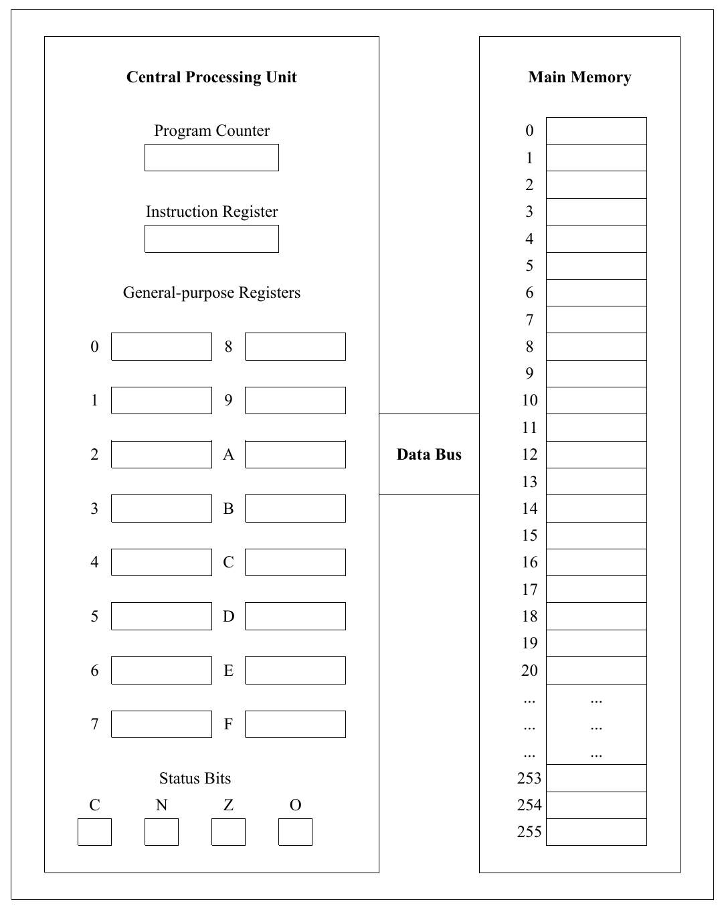
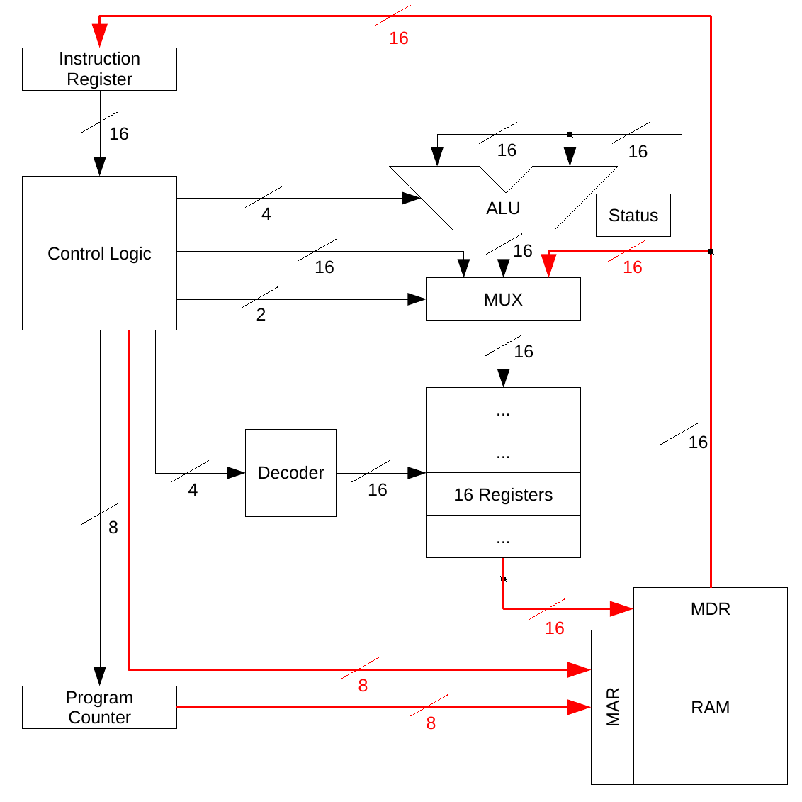

At this point, we have all of the building blocks required to design a simple microcomputer. Primarily, we will focus on two of the higher-level components: the central processing unit (CPU) and main memory, and how they can be constructed from low-level circuits. In order to have a context in which to frame this discussion, we need to briefly discuss register-based machines.

::: {.callout-note}
# Architecture
**Definition**: The general organization of a machine is often referred to as its **architecture**.
:::

Over the years, computer scientists and engineers have explored a wide variety of computer architectures. The register-based machine is the most popular architecture.

::: {.callout-note}
# Register
**Definition**: A **register** is similar to memory in that it can store data; however, it is much more quickly accessible because it is located within the CPU.
:::

Although we will use a "toy" computer, designed solely for the purpose of instruction, it embodies most of the major features of register-based machines. The sample (virtual) machine that we will use is shown in the figure below. It consists of two major parts: main memory and a CPU. These two components are connected together via the data bus, which allows information to be copied between the CPU and main memory.

The purpose of main memory is to store computer programs and the data on which they act. The main memory of the virtual machine can be visualized as a list (or array) of 256 storage locations, numbered 0 to 255. Each of these locations is individually addressable. In other words, the main memory unit can be given an address and told to retrieve a value from that location, or be given an address and told to write a value to that location.

The purpose of the CPU is to perform the arithmetic and logic functions specified by the instructions of a computer program. CPUs are complex devices composed of many functional units. One of the most prominent features of the CPUs of register-based machines is a large collection of general-purpose registers. The virtual machine contains sixteen registers, labeled 0 through 9 and A through F.

Registers can be directly manipulated by the arithmetic and logic units of the CPU. Main memory locations cannot. In order to perform any kind of arithmetic or logic operation on values stored in main memory, it is necessary to copy those values into CPU registers, manipulate the registers in a desired manner, and then copy the results back to main memory. For example, in order to add two numbers stored in main memory using the virtual machine:

1. Copy the values of both numbers from main memory into separate CPU registers;

2. Add the contents of those registers, placing the result into yet another register; and

3. Copy the result of the addition operation back into a main memory location.

In addition to the general-purpose registers, there are a number of special-purpose registers important to the operation of the CPU. These registers include the instruction register, the program counter, and the status bits.

::: {.callout-note}
# Special Purpose Registers

The **instruction register** holds a copy of the program instruction that the CPU is currently executing. 

The **program counter** contains the address of the next instruction to be executed. 

The **status bits** are used to hold information about the most recently performed computation (e.g., was a carry generated from the most recent binary addition, was the result zero, was some result negative, did an overflow occur, and so on).
:::

More detail about these special-purpose registers is beyond the scope of this lesson.

Real-world computers are similar to the virtual machine in that they contain main memory, a CPU, and a data bus. The virtual machine differs from real machines in that it has no I/O devices (such as keyboards, display screens, mice, and so on), nor any long-term storage devices (such as hard disk drives). The size of its memory is also very small, containing only 256 memory locations. Modern computers typically have hundreds of millions of memory locations. Technically, these memory locations are known as words.

::: {.callout-note}
# Word
**Definition**: A **word** is the base unit of data that is supported by a CPU.
:::

Today's computers usually have word sizes that are 32 or 64 bits. The registers are typically word-sized. There are other differences between the virtual machine and real-world computers, such as the size of the numbers it can manipulate and the limited number of commands in its machine language.

The main memory of the virtual machine is composed of 256 words, each 16 bits wide. The interface to main memory (RAM) consists of two registers: the memory address register (MAR), and the memory data register (MDR). During both "read" and "write" operations, the MAR is used to hold the address of the memory location to be accessed. Since there are 256 words of memory in the virtual machine (numbered 0 to 255), the MAR is eight bits wide, enabling it to hold addresses in the range 00000000~2~ to 11111111~2~ (i.e., 0 to 255). During "write" operations, the 16-bit value to be written into memory will be placed in the MDR. During "read" operations the value of the memory location to be read will be output to the MDR. Thus, the memory data register can function both in an input role (for "write" operations) and in an output role (for "read" operations). The MAR, on the other hand, always functions in an input role, specifying the location to be accessed.

The following figure primarily details the virtual machine CPU. Special emphasis is given to illustrating the major control and data lines interconnecting the various components:

We now address the final piece of the puzzle concerning machine language programs by illustrating how the machine actually goes about executing a program. At the machine level, all a computer ever does is perform the following five tasks (collectively known as the **instruction cycle**) over and over:

1. Fetch the next instruction from memory. To do so, look up in the instruction register the bit pattern found at the address held in the program counter.
2. Increment the program counter by 1 in order to point to the next instruction in the current sequence.
3. Decode the current instruction. This involves correctly identifying the various parts of an instruction based on its op-code. The **op-code** is the part of a machine language instruction that defines what operation is to be performed (e.g., add). The other parts of a machine language instruction are called **operands** on which the op-code is applied.
4. Execute the instruction by triggering the relevant arithmetic or logic operations in the appropriate hardware. Results are computed and routed to their appropriate destinations. Appropriate destinations include the general-purpose registers, special purpose registers such as the program counter, and main memory.
5. Return to Step 1.

That's all a computer ever does! There is no magic; no smoke and mirrors. Just a simple, but very fast machine running through the instruction cycle over and over, tens or hundreds of millions of times each second.

The control logic, or control unit, is the component of the virtual machine that is responsible for implementing the instruction cycle. It does so by generating the signals necessary to direct the other components of the machine, telling them to act in an orderly and coordinated manner. The control unit is sometimes referred to as the "traffic cop" of the CPU. Input to the control unit is from the instruction register because it needs to have the bit pattern that is in an instruction in order to tell it what to do. Because of the central role played by the control unit, its outputs are connected by various data and signal lines to most of the other components of the CPU.

The ALU is responsible for the math and logic operations performed by the machine. If the control unit is the "traffic cop", then the ALU is the "calculator", responsible for performing addition, subtraction, and the various logic operations. The ALU of the virtual machine receives two 16-bit input values from the general-purpose registers and one 4-bit control code from the control unit. The 16-bit values represent the results of the operations. These bits are also connected to the status register. Output from the ALU is directed to a multiplexer so that it can be routed to the general-purpose registers.

Taking a closer look at the multiplexer, we see that it has three 16-bit data inputs. One input originates from the control unit, one from the MDR, and one from the ALU. The reason for three data inputs is that there are three sources that can generate register values: a control instruction from the control unit can generate a value, the instruction (an operand) is located in the instruction register, and the ALU produces result values. Therefore, one of the inputs on each of the standard four-input multiplexers will be unused.

Building this multiplexer is a straightforward exercise: we simply arrange sixteen of the four-input multiplexers shown earlier in parallel, even though we only need three of their four inputs. The reason for using four-input multiplexers as opposed to two-input ones is that, even though we only have three inputs, we come in powers of two: two input, four input, eight input. Therefore, one of the inputs on each of the standard four-input multiplexers shown earlier will be unused. While this may seem a tad wasteful, it won't cause any operational difficulties.

The final component of the CPU that we will look at is the four-input decoder, located between the control unit and the sixteen general-purpose registers. The task of this decoder is to select one of the sixteen registers in response to a 4-bit address arriving from the control unit. This decoder would be similar to the three-to-eight decoder shown earlier; however, it would be extended to handle four input lines and sixteen output lines.

The memory location to be retrieved (and therefore the address to be loaded into the MAR) can originate from two separate CPU components: the control unit or the program counter. The address comes from the program counter when the machine is fetching the next instruction. The address comes from the control unit when the machine is performing an instruction fetch, such as a variable from memory.

The input data lines leading to the MDR originate from the block of sixteen general-purpose registers. This makes sense, because in order to write a 16-bit memory value, we need a 16-bit source. The MDR has two sets of 16-bit data lines connected to the MDR, one set for input and one set for output.

Looking at the output data lines originating from the MDR, we see that a 16-bit memory value can be transferred to either the instruction register or the multiplexer that routes values to the general-purpose registers. If the machine is performing an instruction fetch, the bit pattern being read from memory represents an instruction and needs to be sent to the instruction register. If the machine is in the process of fetching an operand, that operand should end up in one of the sixteen general-purpose registers and is thus sent to the multiplexer.

Even though the virtual machine is a very simple microcomputer by today's standards, it is still much too complex for us to go through a full design of its components. The development of its components, however, is constructed from the combinational and sequential circuits discussed throughout this curriculum. We have arrived at the bare machine that lies underneath the many layers of software. There is no magic; no smoke and mirrors.